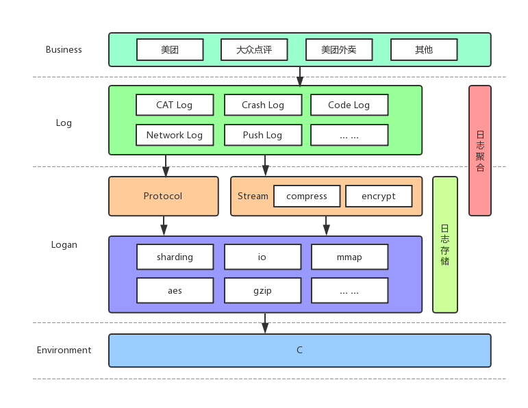
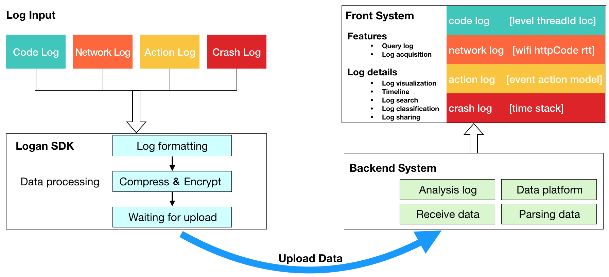
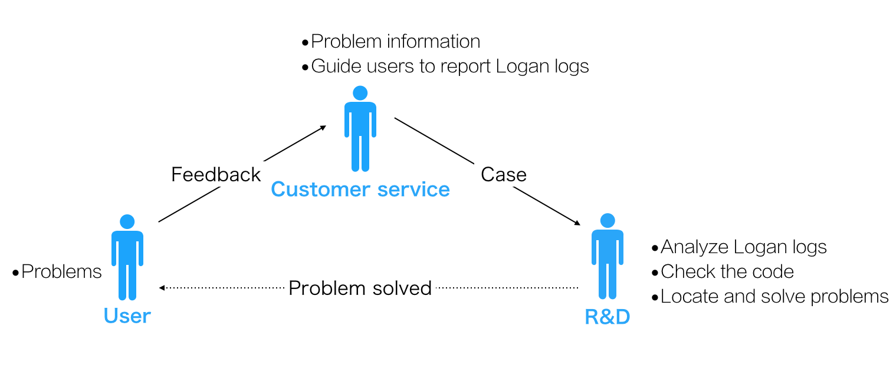
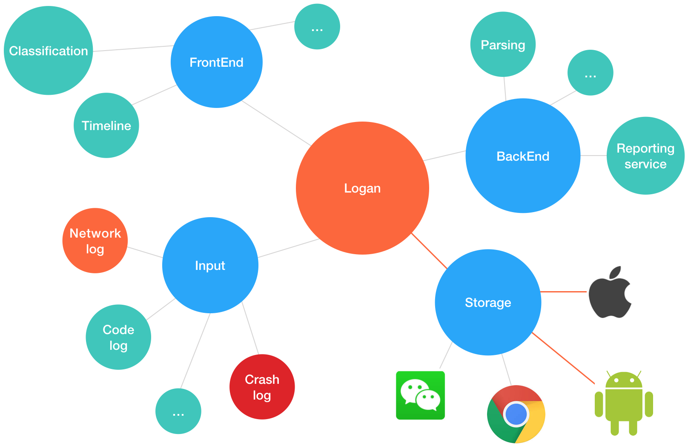

# Logan

[](https://raw.githubusercontent.com/Meituan-Dianping/Logan/master/LICENSE)
[](https://github.com/Meituan-Dianping/Logan/releases)
[](https://github.com/Meituan-Dianping/Logan/pulls)
[](https://github.com/Meituan-Dianping/Logan/wiki)

Logan is a lightweight case logging system based on mobile platform.

[中文说明](./README-zh.md)



# Getting started

## Android

### Prerequisites

If you want to build the source, make sure your NDK version is not higher than **16.1.4479499**.

### Installation

Add the following content in the project `build.gradle` file:

```groovy
compile 'com.dianping.android.sdk:logan:1.0.0'
```

### Usage

You must init Logan before you use it. For example:

```java
LoganConfig config = new LoganConfig.Builder()
        .setCachePath(getApplicationContext().getFilesDir().getAbsolutePath())
        .setPath(getApplicationContext().getExternalFilesDir(null).getAbsolutePath()
                + File.separator + "logan_v1")
        .setEncryptKey16("0123456789012345".getBytes())
        .setEncryptIV16("0123456789012345".getBytes())
        .build();
Logan.init(config);
```

After you init Logan, you can use Logan to write a log. Like this:

```java
Logan.w("test logan", 1);
```

Logan.w method has two parameters:

- **String log**: What you want to write;
- **int type**: Log type. This is very important, best practices below content will show you how to using log type parameter.

If you want to write log to file immediately, you need to call flush function:

```java
Logan.f();
```

If you want to see all of the log file information, you need to call getAllFilesInfo function:

```java
Map<String, Long> map = Logan.getAllFilesInfo();
```

- key: Log file date;
- value: Log file size(Bytes).

#### Upload

Logan internal provides logging upload mechanism, in view of the need to upload the log to do the preprocessing. If you want to upload log file, you need to implement a SendLogRunnable:

```java
public class RealSendLogRunnable extends SendLogRunnable {

    @Override
    public void sendLog(File logFile) {
      // logFile: After the pretreatment is going to upload the log file
    }
}
```

Finally you need to call Logan.s method:

```java
Logan.s(date, mSendLogRunnable);
```

One of the first parameter is date array(yyyy-MM-dd).

## iOS

### Installation

Logan supports CocoaPods methods for installing the library in a project.

#### Podfile

Import Logan in Xcode project, add Logan in podfile.

```ruby
source 'https://github.com/CocoaPods/Specs.git'
platform :ios, '8.0'

target 'TargetName' do
pod 'Logan', '~> 1.0.0'
end
```

Then run the following command:

```bash
$ pod install
```

### Logan Init

You must init Logan before you use it:

```objc
#import "Logan.h"

NSData *keydata = [@"0123456789012345" dataUsingEncoding:NSUTF8StringEncoding]; 
NSData *ivdata = [@"0123456789012345" dataUsingEncoding:NSUTF8StringEncoding];
uint64_t file_max = 10 * 1024 * 1024;
// logan init，incoming 16-bit key，16-bit iv，largest written to the file size(byte)
loganInit(keydata, ivdata, file_max);

#if DEBUG
loganUseASL(YES);
#endif
```

### Usage

Write a log:

```objc
logan(1, @"this is a test");
```
## Log parsing
### java
Copy Logan/parser-java to your project.

Parsing log data
```java
new LoganParser(Key16.getBytes(),Iv16.getBytes()).parse(InputStream, OutputStream)
```
### node.js
Please refer to Example/Logan-Server/server.js.

## Demo

[How to use demo](https://github.com/Meituan-Dianping/Logan/wiki/How-to-use-demo)

[Log protocol](https://github.com/Meituan-Dianping/Logan/wiki/Log-protocol)

# Best Practices

Before Logan available, log report system is relatively scattered.


To put it simply, the traditional idea is to piece together the problems that appear in the logs of each system, but the new idea is to aggregate and analyze all the logs generated by the user to find the scenes with problems.

The Logan core system consists of four modules:

- Input
- Storage
- BackEnd
- FrontEnd



The new case analysis process is as follows:



# Article

[A lightweight case logging system based on mobile platform developed by Meituan-Dianping — Logan](https://tech.meituan.com/Logan.html)

[Logan: Open Source](https://tech.meituan.com/logan_open_source.html)

# Feature

In the future, we will provide a data platform based on Logan big data, including advanced functions such as machine learning, troubleshooting log solution, and big data feature analysis.

Finally, we hope to provide a more complete integrated case analysis ecosystem.



| Module | Open Source | Processing | Planning |
| :------: | :--: | :-----: | :-: |
| iOS  |   √  |        |    |
| Android | √ |  |  |
| Web |  | √ |  |
| Mini Programs |  | √ |  |
| Back End |  |  | √ |
| Front End |  |  | √ |

# Contributing

**For more information about contributing PRs and issues, see our [Contribution Guidelines](./CONTRIBUTING.md).**

# Authors

* **White Bai** - Core Developer - [baitian0521](https://github.com/baitian0521)

* **Richard Cao** - Core Developer - [Richard-Cao](https://github.com/Richard-Cao)

* **jiangteng** - Core Developer - [jiangteng](https://github.com/jiangteng)

* **yangxiangnan** - Core Developer - [yangxiangnan](https://github.com/yangxiangnan)

* **Mr-xiaojun** - Core Developer - [Mr-xiaojun](https://github.com/Mr-xiaojun)

See also the list of [contributors](https://github.com/Meituan-Dianping/Logan/graphs/contributors) who participated in this project.

# License

Logan is licensed under the MIT License - see the [LICENSE](https://github.com/Meituan-Dianping/Logan/blob/master/LICENSE) file for details.

# Acknowledgments

- [mbedtls](https://github.com/ARMmbed/mbedtls)
- [cJSON](https://github.com/DaveGamble/cJSON)
